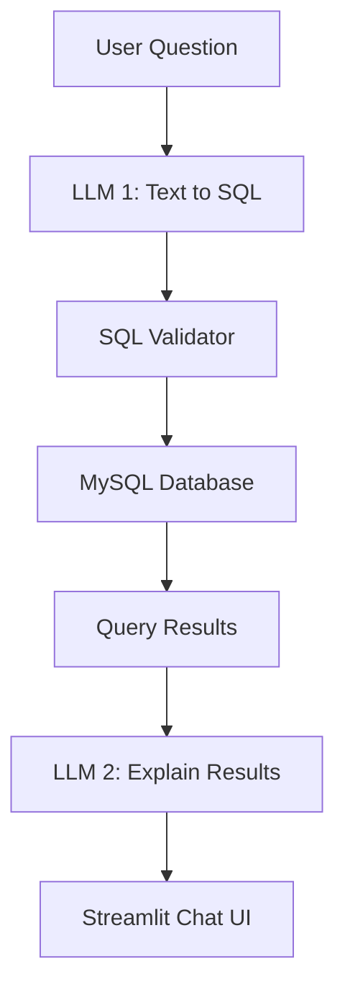
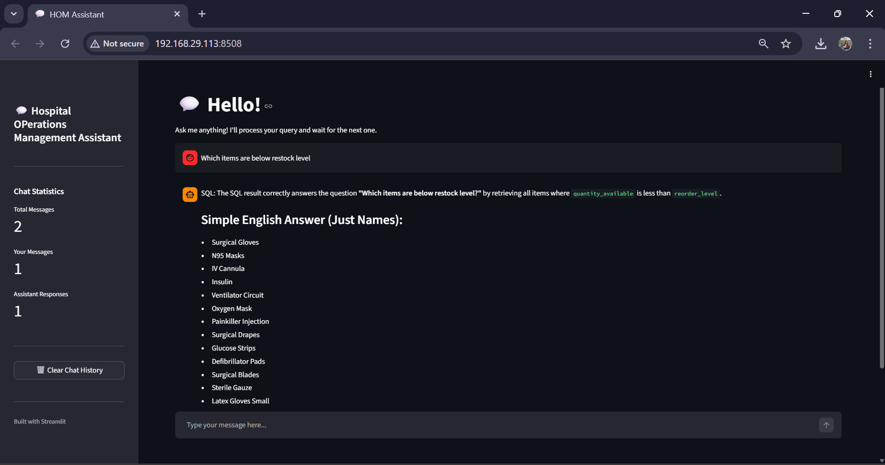

# 🏥 Intelligent Hospital Operations Assistant (Text-to-SQL with LLMs)

An AI-powered hospital operations assistant that allows users to ask **natural language questions** and receive **clear, human-readable answers** based on live database data.

The system converts user queries into SQL using an LLM, safely executes them on a MySQL database, and uses a second LLM to validate and explain the results in simple English.

---

## 🚀 Features

- Natural Language → SQL using Large Language Models  
- Safe SQL generation (SELECT-only, schema-aware)  
- Live MySQL database querying  
- LLM-based result validation and explanation  
- Chat-style user interface built with Streamlit  
- Designed for hospital supply chain & scheduling use cases  

---

## 🔄 System Flow (End-to-End)

1. User asks a question in natural language  
   → Example: *"Which items need restocking?"*

2. LLM #1 converts the question into a **safe SQL query**
   - Uses only known tables & columns
   - Generates SELECT-only queries

3. SQL Validator checks the query
   - Blocks DELETE / UPDATE / DROP
   - Prevents hallucinated columns

4. Query is executed on the **MySQL database**

5. Raw SQL results are passed to **LLM #2**
   - Validates correctness
   - Converts results into simple English

6. Final answer is shown in a **chat-based Streamlit UI**


---

## 🛠️ Tech Stack

- Python  
- LangChain  
- Large Language Models (OpenAI / OpenRouter / Ollama compatible)  
- MySQL  
- Streamlit  
- Prompt Engineering  
- Text-to-SQL  
- Multi-step LLM Pipelines  

---

## 🧠 Architecture Diagram




---

## 🗃️ Database Domain

The database models real hospital operations, including:

- Inventory and medical equipment tracking  
- Supplier management  
- Purchase orders and restocking  
- Medical practitioners and availability  
- Patient assignments and appointment durations  

---

## 💬 Example Questions

- Which items need to be restocked?  
- Which doctors are currently available?  
- List practitioners on leave 

The system responds with **simple English answers**, also gives explanation +  SQL when it requires more context

---

## ▶️ How to Run the Project

### 1. Create a virtual environment
```bash
python -m venv .venv
source .venv/bin/activate   # macOS / Linux
.venv\Scripts\activate      # Windows
```
### 2. Install dependencies
```bash
pip install -r requirements.txt
```

### 3. Configure environment variables
#### Create .env variables
```env
DB_HOST=localhost
DB_USER=root
DB_PASSWORD=your_password
DB_NAME=your_db_name
OPENAI_API_KEY=your_api_key
```
### 4. Run the streamlit app
```bash
streamlit run streamlit_app.py
```

<p align="center">
  
</p>
